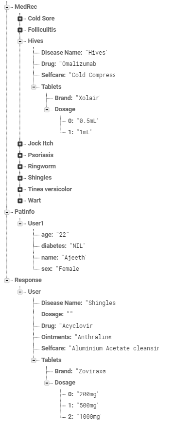

# Skin-Disease-Detection

This applications helps detect a few commonly occuring skin diseases.

List of Diseases: 
1.cold sore  
2.folliculitis 
3.hives 
4.jock itch 
5.psoriasis 
6.ringworm 
7.shingles 
8.tinea 
9.warts 

Medication for the disease is also suggested. However, further research is required to be done on the medication aspect.

# Backend Storage Structure

